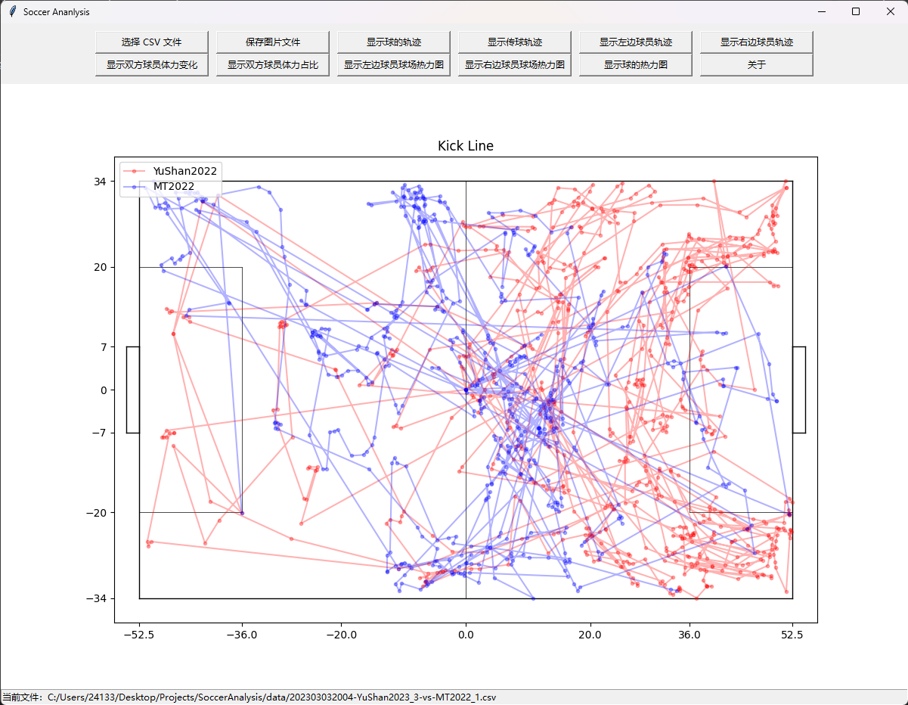
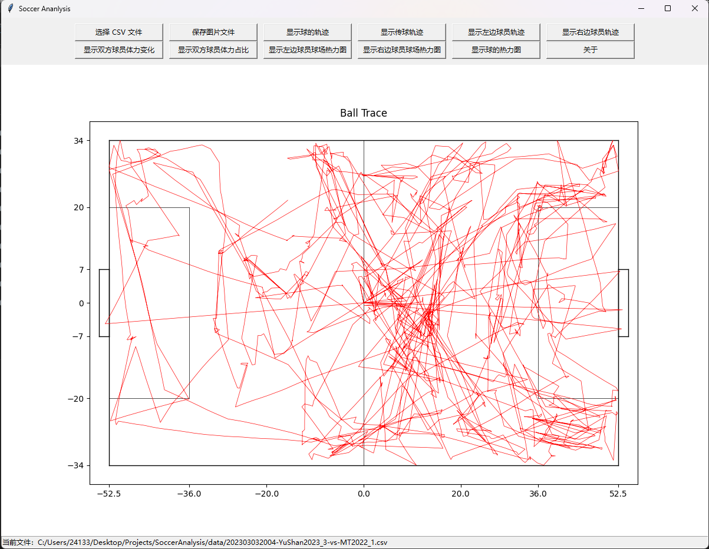
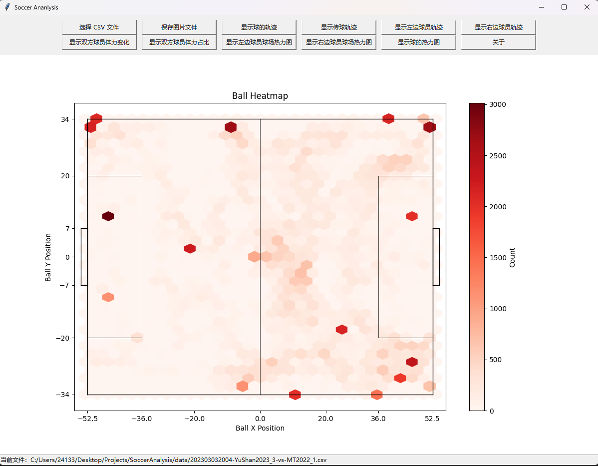
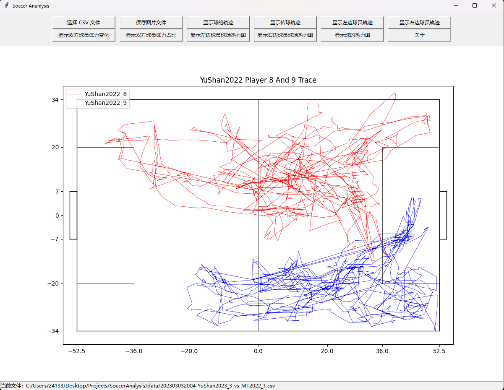
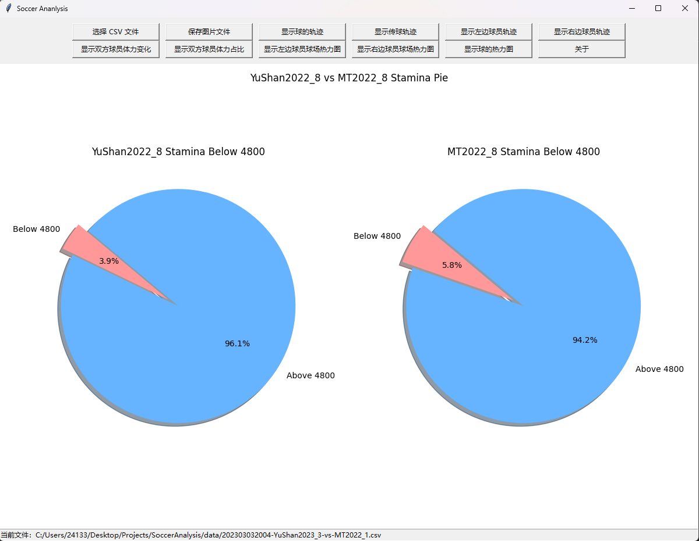

# Soccer Analysis Application

欢迎使用足球数据分析应用程序，这是一个基于Python和Tkinter开发的图形用户界面(GUI)应用程序，用于分析和可视化仿真2D比赛数据。

## 功能特点

- 加载CSV格式的足球比赛数据。
- 显示球的轨迹。
- 展示球员的传球轨迹。
- 展示特定球员的轨迹。
- 展示球员体力变化和占比。
- 展示球员和球的热力图。
- 保存图表为图片文件。

## 系统要求

- Python 3.x
- Tkinter (Python的标准GUI库)
- Matplotlib (绘图库)
- Pandas (数据处理库)

## 安装指南

1. 确保您的系统已安装Python 3.x。
2. 安装所需依赖包：

   ```
   pip install matplotlib pandas
   ```
3. 下载或克隆本应用程序的代码库，或者也可以直接下载dist文件夹下的打包好的SoccerAnalysis.exe程序直接运行。
4. 运行 `SoccerAnalysisApp.py`。

## 使用说明

1. 打开应用程序，点击“选择 CSV 文件”加载数据。
2. 数据加载后，其他按钮将被激活。
3. 点击相应的按钮进行数据可视化分析。
4. 使用“保存图片文件”按钮保存当前显示的图表。
5. 使用显示球员轨迹线管功能按钮时，建议输入两个不同的球员编号。
6. 使用显示球员体力相关功能按钮时，建议输入相同的球员编号。

<<<<<<< Updated upstream
=======
## 截图



>>>>>>> Stashed changes
## 许可

本应用程序采用[MIT许可](LICENSE)。
